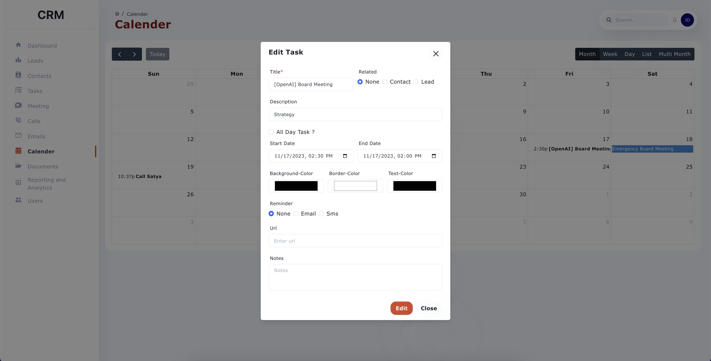
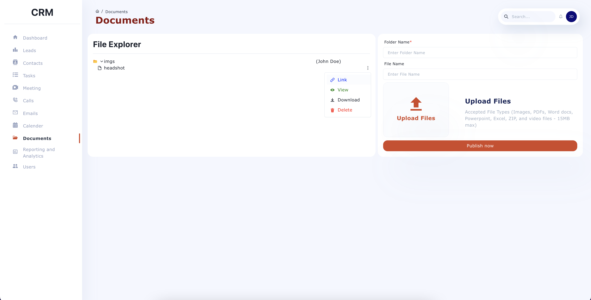

# CRM System README

## Overview

Welcome to the Customer Relationship Management (CRM) system! This project is designed to streamline client interactions and internal processes. Built with a React frontend, an Express backend, and MongoDB for data management, the system helps manage contacts, tasks, leads, and more.

## Technical Design

### Frontend (React)
- **Dashboard**: Summarizes sections like contacts, tasks, and leads.
- **Contact/Task Management**: Full CRUD functionalities for managing contacts, tasks, and other resources.

### Backend (Express, MongoDB)
- **API Routes**: CRUD operations for contacts, leads, tasks, etc.
- **Database**: MongoDB collections for contacts, documents, emails, leads, tasks, etc.

## User Interface

### 1. Login

  

### 2. Home Page

  

### 3. Contacts Page

  

### 3.a Add Contact

  

### 4. Calendar

  

### 4.a Add Calendar Event

  

### 5. Documents

  

## Installation Guide

### Prerequisites
- **Node.js**: Install from [Node.js](https://nodejs.org/).
- **MongoDB Compass** or Atlas account.

### Frontend Installation
1. Download and extract project ZIP.
2. Run `npm install` to install dependencies.
3. Set `baseUrl` in `constant.js`.
4. Run `npm start` to launch.

### Backend Installation
1. Download and extract backend ZIP.
2. Run `npm install`.
3. Configure `.env` with MongoDB credentials.
4. Run `npm start` to start the server.

### Default Admin Access (Local)
- **Email**: admin@gmail.com
- **Password**: admin123
